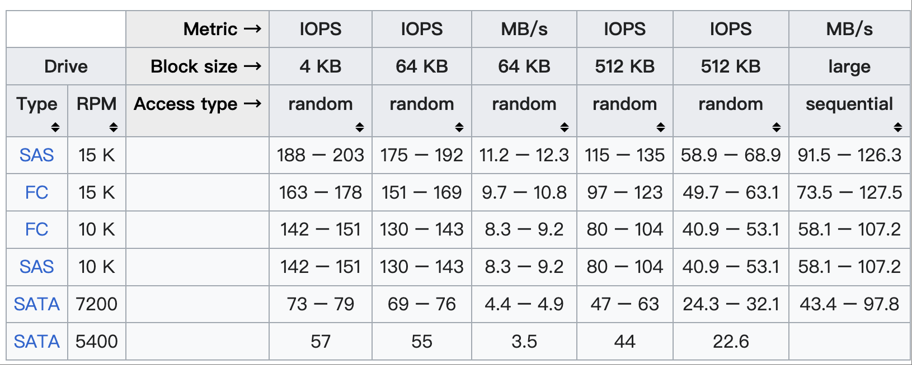

# 为什么要选择适合数据库的硬件

在部署数据库前选择合适的硬件会对后续的集群稳定、集群性能更优都有收益，避免盲目的堆硬件为未来带来不可预估的风险。

# CPU 选择

1、物理机的生产 `CPU` 建议最低选择 18 Core 以上、并且选择支持超线程。

2、在`CPU`的选择上建议选择主频在2.5GHz以上的CPU，并且CPU的指令支持sse2、sse4、avx及avx2的指令集。

3、如果是虚拟机需要把`CPU`工作模式设置为直通模式，与宿主机的指令保持一致。

4、`CPU` 建议使用直通模式（Passthrough Mode）,避免使用性能模式（Performance Mode）和仿真模式（Emulation Mode）。

## CPU 查看常用命令
```shell
# 查看物理CPU个数
cat /proc/cpuinfo|grep "physical id"|sort -u|wc -l

# 查看每个物理CPU中core的个数(即核数)
cat /proc/cpuinfo|grep "cpu cores"|uniq

# 查看逻辑CPU的个数
cat /proc/cpuinfo|grep "processor"|wc -l

# 查看CPU的名称型号
cat /proc/cpuinfo|grep "name"|cut -f2 -d:|uniq

# 查看CPU的睿频
grep -E '^model name|^cpu MHz' /proc/cpuinfo

# 查看物理CPU个数
grep "physical id" /proc/cpuinfo | sort | uniq| wc -l

# 查看每个物理CPU中core的个数(即核数)
grep "cpu cores" /proc/cpuinfo | uniq

# 查看逻辑CPU的个数
grep "processor" /proc/cpuinfo | wc -l
```


# 储存

如果是SATA最低选择10K及以上的，7200 RPM的SATA 盘在物理寻道时间、旋转延迟时间上都比较长再加上现在的磁盘的IOPS都比较低，就会导致写入效率下降。



| 转速 | 物理寻道时间 | 旋转延迟时间 | 理论的最大IOPS |
|:------:|:------:|:------:|:------:|
| 7200 RPM | 9ms | 4.17ms | 76 IOPS |
|  10000   | 6ms | 3ms | 111 IOPS |
|  15000   | 4ms | 2ms | 166 IOPS |

> IOPS = 1000 ms/ (寻道时间 + 旋转延迟)


[1]. https://en.wikipedia.org/wiki/IOPS

[2]. https://colin-scott.github.io/personal_website/research/interactive_latency.html


# RAID 卡

各种RAID级别的Write Penalty值

| RAID Level | Write Penalty (ms) |
| :----------: | :----------: |
| RAID-0     | 1                  |
| RAID-1     | 2                  |
| RAID-5     | 4                  |
| RAID-6     | 6                  |
| RAID-10    | 2                  |


RAID-0：直接的条带，数据每次写入对应物理磁盘上的一次写入。

RAID-1和10：RAID-1 和RAID-10的写惩罚很简单理解，因为数据的镜像存在的，所以一次写入会有两次。

RAID-5：RAID-5由于要计算校验位的机制存在，需要读数据、读校验位、写数据、写校验位四个步骤，所以RAID-5的写惩罚值是4。

RAID-6：RAID-6由于有两个校验位的存在，与RAID-5相比，需要读取两次校验位和写入两次校验位，所以RAID-6的写惩罚值是6。


# 网络


# 参考资料

[1]. (https://mp.weixin.qq.com/s/cUCcyfs_xfl2WFqM-LICWQ)

[2]. (https://mp.weixin.qq.com/s/XZLpAr7Oau0rwtAm7B_3TQ)

[3]. https://cloudberry.apache.org/zh/docs/cbdb-op-software-hardware/


