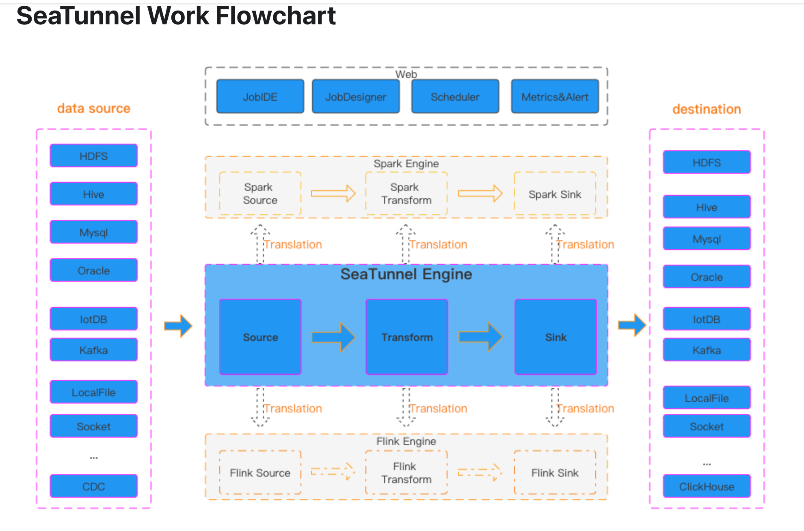

# SeaTunnel
SeaTunnel 是一款非常易于使用、超高性价比的分布式数据集成平台，支持海量数据的实时同步。它每天能够稳定且高效地同步数百亿条数据，目前已有近百家企业将其应用于生产环境。

海隧专注于数据集成与数据同步，主要旨在解决数据集成领域的常见问题：

多种数据源：存在数百种常用但版本不兼容的数据源。随着新技术的出现，更多数据源不断涌现。用户很难找到一款能全面且快速支持这些数据源的工具。
复杂的同步场景：数据同步需要支持多种同步场景，如离线全量同步、离线增量同步、变更数据捕获（CDC）、实时同步以及全库同步。
高资源需求：现有的数据集成和数据同步工具在完成海量小表的实时同步时，往往需要大量的计算资源或 JDBC 连接资源。这增加了企业的负担。
缺乏质量与监控：数据集成和同步过程中常出现数据丢失或重复的情况。同步过程缺乏监控，无法在任务执行过程中直观了解数据的真实情况。
复杂的技术栈：企业使用的技术组件各不相同，用户需要针对不同组件开发相应的同步程序来完成数据集成。
管理与维护难度大：受限于不同的底层技术组件（Flink/Spark），离线同步和实时同步往往需要分别开发和管理，这增加了管理与维护的难度。

# 资料参考
[仓库地址](https://github.com/apache/seatunnel)

[网址](https://seatunnel.apache.org/Apache) 

[SeaTunnel 下载地址](https://seatunnel.apache.org/download)

[SeaTunnel 同步工具](https://github.com/apache/seatunnel/pulls)

[Twitter](https://x.com/ASFSeaTunnel)
