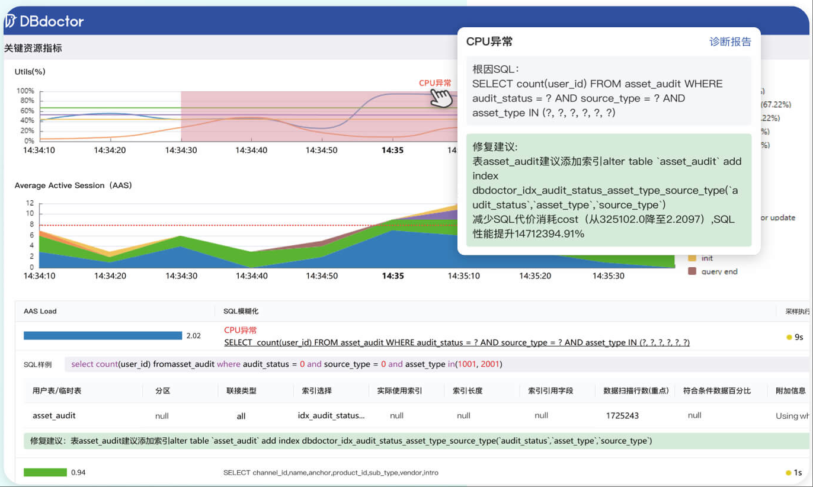
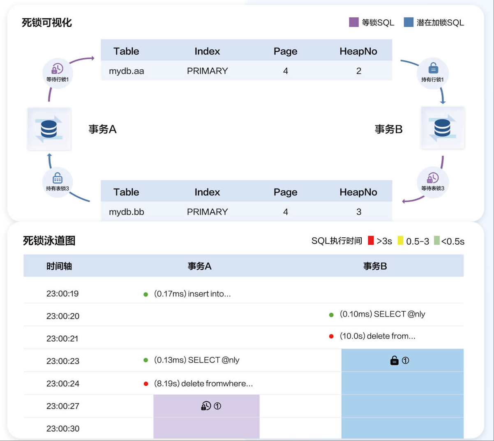
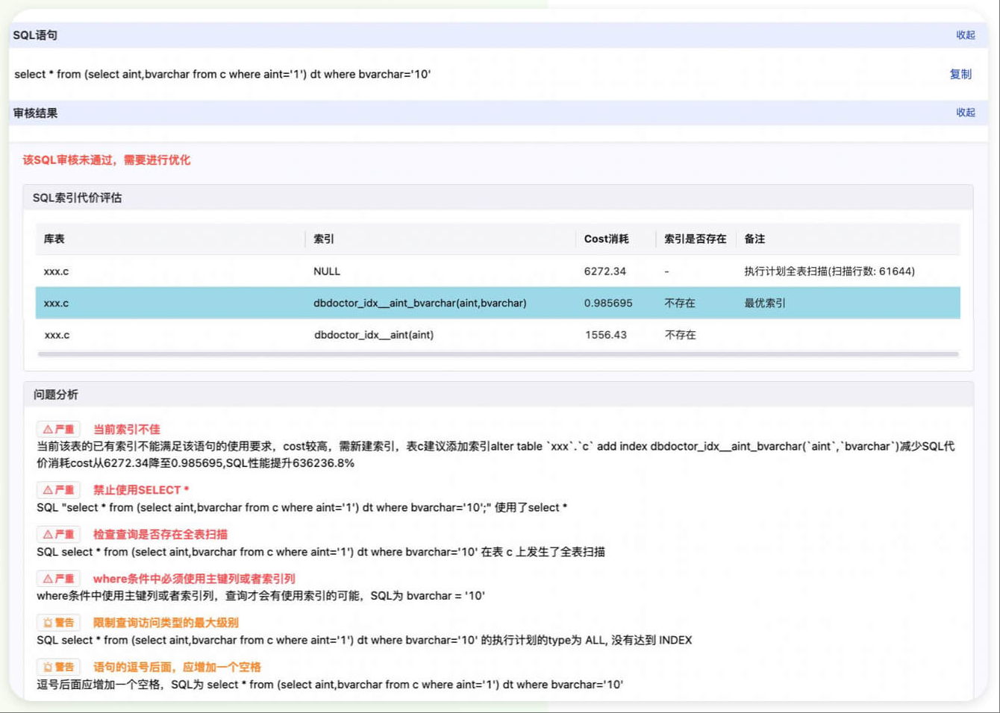
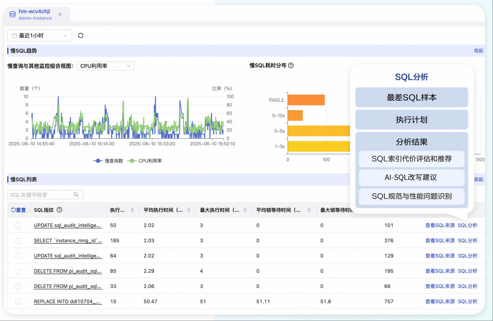
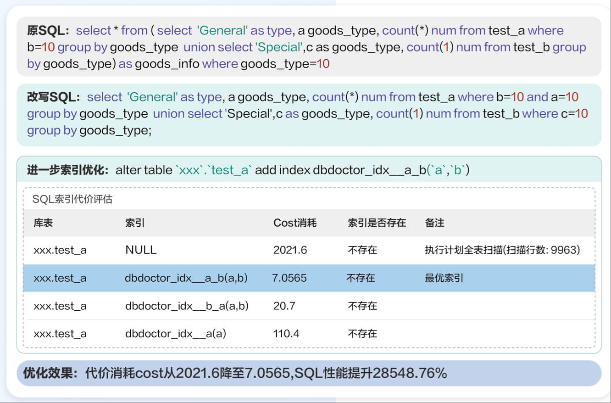

#  DBdoctor 是什么
行业独家集『性能监控与诊断、SQL审核与治理、数据脱敏与防护』于一体的数据库智能管理平台。基于eBPF快速诊断性能问题，开发测试阶段即可评估SQL未来上线后性能，融合DeepSeek和Cost优化器实现SQL精准改写。目前已适配商业/开源/国产/云等20+国内外主流数据库。

# 为什么选择DBdoctor
海信聚好看服务全球亿万智能终端用户，拥有国内最大的互联网电视云平台，管理上万套数据库，历经春晚奥运等流量洪峰场景验证，成功孵化出数据库内核级性能诊断工具DBdoctor。作为深耕行业七年的独角兽企业，我们拥有500余人的研发团队，致力于持续创新和长期技术支持。解决方案覆盖事前主动识别，事中实时诊断，事后快速回溯的全场景，可为客户提供数据库全生命周期的智能化管理服务。

# 资料参考
1. [DBdoctor](https://dbdoctor.hisensecloud.com/)

