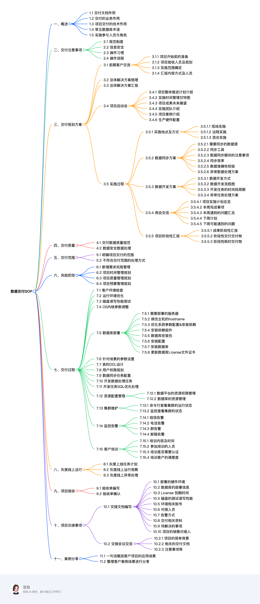

#  项目交付SOP目录 
```
   一、概述
        1.1 交付文档作用
        1.2 交付的业务作用
        1.3 项目交付的技术作用
        1.4 常见数据库术语
        1.5 实施参与人员与角色
    二、交付注意事项
        2.1 规范制度
        2.2 信息安全
        2.3 操作习惯
        2.4 操作流程
    三、交付规划方案
        3.1 前期客户交流
            3.1.1 项目开始前的准备
            3.1.2 项目验收人员及规划
            3.1.3 实施范围确定
            3.1.4 汇报内容方式及人员
        3.2 总体解决方案梳理
        3.3 总体解决方案汇报
        3.4 项目启动会
            3.4.1 项目整体推进计划介绍
            3.4.2 实施时间管理甘特图
            3.4.3 项目成果未来展望
            3.4.4 实施团队介绍
            3.4.5 项目案例介绍
            3.4.6 生产硬件配置
        3.5 实施过程
            3.5.1 实施地点及方式
                3.5.1.1 现场实施
                3.5.1.2 远程实施
                3.5.1.3 混合实施
            3.5.2 数据同步方案
                3.5.2.1 需要同步的数据源
                3.5.2.2 同步工具
                3.5.2.3 数据同步期间的注意事项
                3.5.2.4 同步效率
                3.5.2.5 数据准确性校验
                3.5.2.6 异常数据处理方案
            3.5.3 数据开发方案
                3.5.3.1 数据开发方式
                3.5.3.2 数据开发流程图
                3.5.3.3 开发任务的时间段周期
                3.5.3.4 异常任务处理方案
            3.5.4 周会交流
                3.5.4.1 项目实施计划总览
                3.5.4.2 本周完成事项
                3.5.4.3 本周遇到的问题汇总
                3.5.4.4 下周计划
                3.5.4.5 下周可能遇到的问题
            3.5.5 项目阶段性汇报
                3.5.5.1 成果阶段性汇报
                3.5.5.2 阶段性交付交付物
                3.5.5.3 阶段性耗时交付物
    四、交付质量
        4.1 交付数据质量规范
        4.2 数据安全数据处理
    五、交付范围
        5.1 明确项目交付的范围
        5.2 不符合交付范围的处理方式
    六、风险把控
        6.1 新增需求风险管理
        6.2 项目时间管理规划
        6.3 项目质量管理规划
        6.4 项目预算管理规划
    七、交付过程
        7.1 客户环境检查
        7.2 运行环境优化
        7.3 磁盘读写性能测试
        7.4 OS内核参数调整
        7.5 数据库部署
            7.5.1 需要部署的服务器
            7.5.2 修改主机的hostname
            7.5.3 优化系统参数配置&安装依赖
            7.5.4 安装依赖组件
            7.5.5 数据库安装包
            7.5.6 安装配置
            7.5.7 安装数据库
            7.5.8 更新数据库License文件证书
        7.6 针对场景的参数设置
        7.7 表的DDL设计
        7.8 用户权限规划
        7.9 数据同步任务配置
        7.10 开发数据处理任务
        7.11 开发任务SQL优化处理
        7.12 资源配置管理
            7.12.1 数据平台的资源权限管理
            7.12.2 数据库的资源管理
        7.13 集群维护
            7.13.1 命令行查看集群的运行状态
            7.13.2 监控查看集群的状态
        7.14 监控告警
            7.14.1 短信告警
            7.14.2 电话告警
            7.14.3 群告警
            7.14.4 邮箱告警
        7.15 客户培训
            7.15.1 培训内容及时间
            7.15.2 参加培训的人员
            7.15.3 培训是否需要认证
            7.15.4 培训客户的满意度
    八、灰度线上运行
        8.1 灰度上线任务计划
        8.2 灰度线上运行观察
        8.3 灰度线上异常处理
    九、项目验收
        9.1 验收单编写
        9.2 验收单确认
    十、项目交接事项
        10.1 交接文档编写
            10.1 部署的硬件环境
            10.2 数据库的部署信息
            10.3 License 到期时间
            10.4 磁盘的测试读写性能
            10.5 环境相关账号
            10.6 对接人员
            10.7 告警方式
            10.8 交付相关资料
            10.9 待解决的事项
            10.10 项目的销售对接人 
        10.2 交接会议交流
            10.2.1 项目的简单背景
            10.2.2 相关的交付文档
            10.2.3 注意事项等 
    十一、案例分享
        11.1 一句话概括客户项目的应用场景
        11.2 整理客户案例场景进行分享
```

