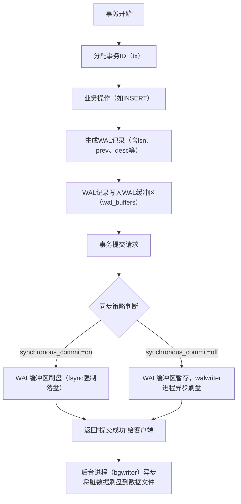

# PostgreSQL的WAL日志详解

想了解PostgreSQL的WAL日志前先了解下什么是 WAL 日志。

# 什么是 WAL 日志

WAL（Write-Ahead Logging，预写式日志是PostgreSQL实现事务 ACID 特性的核心底层机制，其核心原则是 **"先写日志，再改数据"**，所有对数据库的修改操作，必须先以日志形式持久化到磁盘，再更新内存中的数据缓存（后续由bgwriter后台进程异步刷盘到数据文件），以此确保数据的持久性、一致性与故障可恢复性。

# WAL 日志文件基础结构

1. 存储位置：默认位于`$PGDATA/pg_wal`目录，权限严格限制为仅数据库进程可读写。
2. 文件规格：以固定大小的`sengment`形式存储，默认单个文件大小为 16MB，可通过编译参数`--with-wal-segsize`调整，支持 1MB~1GB。
3. 文件命名：采用 24 位十六进制命名，例如`00000001000000760000007E`，前 8 位为时间线 ID，TLI，用于主备切换与恢复，中间 16 位为段文件编号，确保日志的顺序性与唯一性。
4. 记录组成：每个段文件包含多条"WAL 记录"，单条记录对应一个具体的数据库操作,比如INSERT、COMMIT、检查点等，记录间通过 LSN 形成链式关联。

我们清楚了什么是WAL以及组成WAL的基础结构，而WAL的记录的是什么内容，接下来我们继续探究。

# pg_waldump 输出解析

`pg_waldump`是 PostgreSQL 官方提供的 WAL 日志解析工具，安装在`$bin` 目录下，可将二进制日志转换为人类可读的文本格式。以下是用户提供的日志片段及对应场景解读：

`pg_waldump` 的使用命令如下：
```sql
[postgres@mdw bin]$ ./pg_waldump --help
pg_waldump decodes and displays PostgreSQL write-ahead logs for debugging.

Usage:
  pg_waldump [OPTION]... [STARTSEG [ENDSEG]]

Options:
  -b, --bkp-details      output detailed information about backup blocks
  -B, --block=N          with --relation, only show records that modify block N
  -e, --end=RECPTR       stop reading at WAL location RECPTR
  -f, --follow           keep retrying after reaching end of WAL
  -F, --fork=FORK        only show records that modify blocks in fork FORK;
                         valid names are main, fsm, vm, init
  -n, --limit=N          number of records to display
  -p, --path=PATH        directory in which to find WAL segment files or a
                         directory with a ./pg_wal that contains such files
                         (default: current directory, ./pg_wal, $PGDATA/pg_wal)
  -q, --quiet            do not print any output, except for errors
  -r, --rmgr=RMGR        only show records generated by resource manager RMGR;
                         use --rmgr=list to list valid resource manager names
  -R, --relation=T/D/R   only show records that modify blocks in relation T/D/R
  -s, --start=RECPTR     start reading at WAL location RECPTR
  -t, --timeline=TLI     timeline from which to read WAL records
                         (default: 1 or the value used in STARTSEG)
  -V, --version          output version information, then exit
  -w, --fullpage         only show records with a full page write
  -x, --xid=XID          only show records with transaction ID XID
  -z, --stats[=record]   show statistics instead of records
                         (optionally, show per-record statistics)
  --save-fullpage=DIR    save full page images to DIR
  -?, --help             show this help, then exit

Report bugs to <pgsql-bugs@lists.postgresql.org>.
PostgreSQL home page: <https://www.postgresql.org/>
```

解析后会输出以下的实例内容：
```sql
# 场景1：备库同步相关——记录当前主库活跃事务状态（供备库判断事务可见性
rmgr: Standby     len (rec/tot):     50/    50, tx:          0, lsn: 76/7E000028, prev 76/7D018FC0, desc: RUNNING_XACTS nextXid 59555584 latestCompletedXid 59555583 oldestRunningXid 59555584

# 场景2：堆表数据修改——用户事务插入数据（事务ID：59555584
rmgr: Heap        len (rec/tot):     57/    57, tx:   59555584, lsn: 76/7E000060, prev 76/7E000028, desc: INSERT+INIT off 1 flags 0x08, blkref #0: rel 1663/5/53434 blk 0

# 场景3：事务提交——上述插入事务完成提交（时间戳可用于故障排查时序定位
rmgr: Transaction len (rec/tot):     46/    46, tx:   59555584, lsn: 76/7E0000A0, prev 76/7E000060, desc: COMMIT 2023-02-13 16:25:19.441483 EST
```

在以上的输出内容来看，大致可分为以下的核心参数，含义如下：


### rmgr （Resource Manager,资源管理器）

**定义**：标识生成当前 WAL 记录的"功能模块"，每个模块负责一类特定的数据库操作，确保操作的原子性与可恢复性。
**类型及场景**：
| rmgr 类型             | 对应操作场景                                | 典型日志记录示例                     |
| ------------------- | ------------------------------------- | ---------------------------- |
| Standby             | 主备同步相关（如活跃事务列表、备库反馈）                  | RUNNING_XACTS（记录活跃事务 ID 范围） |
| Heap                | 堆表数据操作（INSERT/UPDATE/DELETE/TRUNCATE） | INSERT+INIT（插入新元组）           |
| Transaction         | 事务生命周期管理（BEGIN/COMMIT/ROLLBACK）       | COMMIT（事务提交）                 |
| XLOG                | WAL 系统自身操作（检查点、日志切换、时间线切换）            | CHECKPOINT\_ONLINE（在线检查点）    |
| Btree               | B 树索引维护（索引创建、插入、分裂、删除）                | INSERT_LEAF（索引叶子节点插入）       |
| Database/Tablespace | 数据库 / 表空间生命周期操作（创建、删除、重命名）            | CREATE DATABASE（创建数据库）       |


通过`rmgr`可快速定位日志对应的操作类型，例如故障时筛选`Transaction`类型日志可排查事务提交异常，筛选`Heap`类型可定位数据修改操作。

### 记录长度 len (rec/tot)

**定义**：
- `rec`：WAL 记录"核心数据部分"的长度，单位是字节，即操作本身的描述信息，例如插入数据的位置、事务 ID 等
- `tot`：WAL 记录完整长度,单位是字节，包含`rec` + 日志头部

`len (rec/tot): 57/57` 表示当前记录无额外头部开销，常见于简单操作如 INSERT，而复杂操作如批量更新可能出现 `rec < tot` 头部需存储更多元数据。

单条 WAL 记录最大长度受`max_wal_size`限制，过长操作（如大表 TRUNCATE）会自动拆分多条记录，避免单个段文件被占满。

### TX 事务 ID

**定义**：关联当前 WAL 记录的事务标识符，`tx: 0`表示 "系统事务"无用户业务关联，非 0 值为"用户事务",由 PostgreSQL 自动分配的 32 位递增整数。

**示例对比**：

- `tx: 0`：常见于检查点XLOG、日志切换SWITCH、备库同步Standby等系统操作；
- `tx: 59555584`：用户发起的业务事务，如上述 INSERT 操作，可通过`txid_current()`在数据库中查询当前活跃事务 ID。

故障时通过`tx`可关联到具体业务事务，例如某事务提交失败，可筛选`tx: 59555584`的所有日志，排查操作链路是否完整。

### lsn（Log Sequence Number，日志序列号）

**定义**：WAL 记录的全局唯一标识符，用于标记日志的生成顺序与物理位置，是崩溃恢复、主备同步的核心定位依据。
**格式解析**：采用 `高位/低位` 的十六进制表示，如`76/7E000028`。
- 高位（`76`）：对应 WAL 段文件的"编号部分"，即段文件名中间 16 位的前半部分；
- 低位（`7E000028`）：记录在段文件中的"物理偏移量"

### prev（前序 LSN）

**定义**：当前 WAL 记录的"前一条记录"的 LSN。

- 完整性校验：若某记录的`prev`与前一条记录的`lsn`不匹配，说明日志存在损坏
- 恢复顺序保障：重放日志时，通过`prev`确保操作按原顺序执行，避免数据不一致。

### desc（操作描述）

**定义**：WAL 记录的"可阅读的说明"，包含操作的具体细节，是运维排查的核心参考信息。以下结合用户示例拆解关键场景：


#### Standby 类型

```sql
desc: RUNNING\_XACTS nextXid 59555584 latestCompletedXid 59555583 oldestRunningXid 59555584
```

关键字段解读：

  - `RUNNING_XACTS`：操作类型，记录当前主库的活跃事务列表；
  - `nextXid`：下一个待分配的事务 ID，确保事务 ID 唯一性；
  - `latestCompletedXid`：最近完成（提交 / 回滚）的事务 ID；
  - `oldestRunningXid`：最早未完成的活跃事务 ID，用于判断事务老化，避免 XID 回卷。
  
  #### Heap 类型
  
 ```sql
desc: INSERT+INIT off 1 flags 0x08, blkref #0: rel 1663/5/53434 blk 0
```

关键字段解读：

  * `INSERT+INIT`：操作类型，插入新元组并初始化元组头部；
  * `off 1`：元组在数据块中的"偏移量"，即该元组存储在数据块的第 1 个位置；
  * `flags 0x08`：元组状态标志 ——`0x08`对应`HEAP_XMAX_INVALID`，表示该元组的"删除事务 ID（xmax）"无效（即元组未被删除）；
  * `blkref #0: rel 1663/5/53434 blk 0`：数据块引用信息。
  * `rel 1663/5/53434`：关联的表标识（格式：表空间 OID / 数据库 OID / 表 OID），可通过`SELECT oid, datname FROM pg_database;`查询数据库 OID，通过`SELECT oid, relname FROM pg_class WHERE oid=53434;`查询表名；
  * `blk 0`：操作的数据块编，即表的第 0 号数据块。
  
  #### Transaction 类型
  
```sql
desc: COMMIT 2023-02-13 16:25:19.441483 EST
```

关键字段解读：

* `COMMIT`：操作类型，事务完成提交；
* 时间戳（`2023-02-13 16:25:19.441483 EST`）：事务提交的精确时间。

### WAL 日志的产生机制



### 同步策略（synchronous_commit 参数）

PostgreSQL 通过 ` synchronous_commit `参数控制 WAL 日志的刷盘时机：

| 参数值           | 刷盘时机                             | 数据安全性           | 性能              | 适用场景           |
| ------------- | -------------------------------- | --------------- | --------------- | -------------- |
| on（默认）        | 事务提交时立即刷盘（fsync）                 | 最高（无数据丢失风险）     | 较低（每次提交有 IO 等待） | 金融、电商等核心业务库    |
| off           | 事务提交时仅写入缓冲区，walwriter 每 200ms 刷盘 | 较低（崩溃可能丢失最近事务）  | 较高（减少 IO 等待）    | 非核心业务、日志库、测试环境 |
| local         | 仅确保刷到本地磁盘，不等待备库同步                | 中（本地无丢失，备库可能延迟） | 中               | 单主多备的非核心场景     |
| remote_write | 确保日志发送到备库并写入备库缓冲区                | 较高（主库崩溃可从备库恢复）  | 中高              | 主备同步要求较高的场景    |

### 检查点机制（Checkpoint）

**定义**：数据库定期将"内存中的脏数据"，已修改但未写入数据文件的数据刷盘，并记录"检查点 LSN"的操作，是减少崩溃恢复时间的核心机制。

**触发条件**：
时间触发：达到`checkpoint_timeout`（默认 5 分钟，可通过`postgresql.conf`调整）；
空间触发：WAL 日志使用量达到`max_wal_size * checkpoint_completion_target`（默认`checkpoint_completion_target=0.9`，即 WAL 使用量达到最大阈值的 90%）；
手动触发：执行`CHECKPOINT;`命令，仅超级用户可执行，建议非紧急情况不手动触发，避免 IO 峰值。

#### 检查点记录示例解读

```sql
rmgr: XLOG        len (rec/tot):    114/   114, tx:          0, lsn: 76/7E000140, prev 76/7E000108, desc: CHECKPOINT\_ONLINE redo 76/7E000108; tli 1; prev tli 1; fpw true; xid 0:59555585; oid 61620; multi 799; offset 1657; oldest xid 716 in DB 1; oldest multi 1 in DB 1; oldest/newest commit timestamp xid: 0/0; oldest running xid 59555585; online
```

关键字段含义：
* `CHECKPOINT_ONLINE`：检查点类型，在线检查点，不阻塞业务读写；另有离线检查点，仅在数据库启动 / 关闭时执行；
  * `redo 76/7E000108`：崩溃恢复时的"重放起始 LSN"即检查点之后的日志需从该 LSN 开始重放；
  * `tli 1`：当前时间线 ID主备切换后会递增，避免日志混淆；
  * `fpw true`：是否启用"全页写"（Full Page Write，防止数据块部分写入导致的损坏，默认开启）；